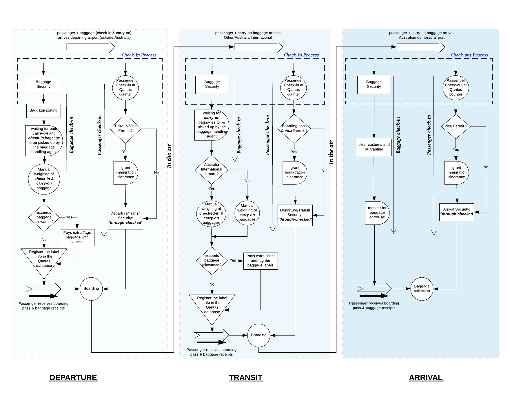
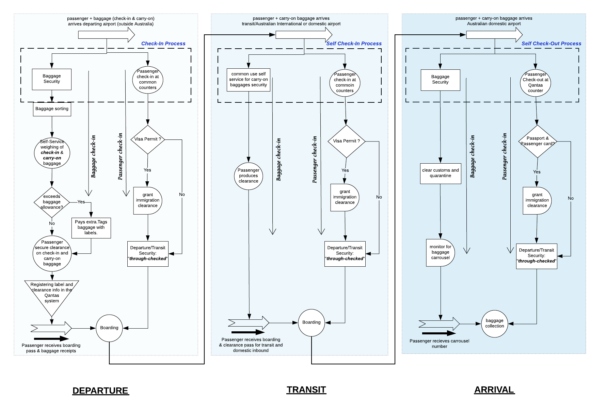

# Qantas Airlines: Delayed Baggage Process and Onboarding of Connecting Flights

## 1. INTRODUCTION
### _1.1 Overview: Quantas Airlines_

This report explores the process delays at Qantas passenger terminals and to assess the impact of delay propagation on other connecting flight/transit type facilities. Streamlining of the business process represents the basis of improving the competitiveness of airport as a service provider (Roguljić, Pavlin & Steiner, 2005). Hence, it is a major concern for the airport authorities to consider functional analysis of business processes by considering the most important sub-system of airport system- passenger and baggage handling.
Qantas is one such such airline brand which is widely regarded as leading long distance airlines and one of the most strongest brands in Australia who’s ethos is “to be a great airline that champion’s the Spirit of Australia” ("Fly with Australia’s most popular airline | Qantas AU", 2018). Qantas main business is the transportation of passengers and offers valuable services to its passengers such as International, Trans-tasman, Domestic and Regional both economy and business class flying experience. 

### _1.2 Airport ground process_ 
Here, baggage plays a crucial role in keeping the passengers happy. A successful baggage security handling system will not keep the passengers waiting to collect the bags and that the bags make up to the connecting flights on time. There are many aspects of this system such as the baggage screening system, baggage handling system, checked baggage inspection system and many more. Similarly, passenger handling and transportation system includes departure control system supporting check-in/check-out subsystems, reservation system etc.

These systems discussed can indirectly/directly introduce delay in connecting flights which directly affects the aircraft turnover efficiency and that can maximize operational and airline scheduling costs.

 
### _1.3    Outline_
The following report will provide an insight to the current business process for baggage security and inspection system and passenger check-in for inbound Qantas flights from both international and domestic airports. By analysing the current business process, we will also highlight some of the challenges faced by the current system to recommend appropriate business model. 

### _1.4    Assumption_
The passenger arrives on time for scheduled departure and the passenger is carrying both the check-in and carry-on baggages.

## 2.	CURRENT BUSINESS PROCESS

To understand the challenges faced by the current business process we will inspect the current business process for ‘baggage security and inspection system’ and ‘passenger check-in system’ as part of ground operations for transportation of the passenger and baggage at each departure, transit and arrival airports respectively.

The checked baggage is inaccessible to passenger during the flight or ride as opposed to carry-on bag. And for Qantas passenger the checked luggage cannot weigh more than 99 lbs and 15 lbs for carry-on luggage.

### _2.1    At Departure_
The passenger arrives the departing airport (outside Australia) in time with the carry-on and check-in baggages and reports to the Qantas counter at the airport terminal where both the baggage and the passenger check-in process takes place simultaneously.

#### i. Passenger Check-In:- 
If the passenger successfully produces the ticket and visa permit(if necessary), is given immigration and pre-departure clearance and sent for _‘through-checked’_ at the departure area.

#### i. Baggage Check-In:- 
Here, both the checked and carry-on baggage are weighed manually by a baggage handling agent for baggage allowance who will tag/label both the baggages. Both the check-in and carry-on baggage label information is stored in the Qantas database. 

### _2.2    At Arrival_
The passenger arrives the arrival airport(Australian domestic) with the carry-on baggages and reports to the Qantas counter at the airport terminal where both the baggage and the passenger check-out process takes place simultaneously.

#### i. Passenger Check-Out:-
If the passenger successfully produces the boarding pass and visa permit(if necessary), is given immigration clearance and sent for _‘through-checked’_ at the departure area.

#### i. Baggage Check-Out:-
Here, the carry-on baggages are inspected by a baggage handling agent for customs and quarantine checks. The checked-in baggages will be available for collection in the arrival halls indicated by the carousel on the monitors.

The passenger heads towards the arrival gate.

## 3.	ANALYSIS OF CURRENT BUSINESS PROCESS

### At Transit

Departure times of the connecting flights can be influenced by ground airport systems such as the service rate of arrival services and facilities (Tošić, 1992) and such as the limited number of check-in counters in Qantas case which can add significant delays to connecting flights.

However, one of the single most significant issues that can affect the length of international service system processing time involves passenger luggage weight restrictions(Chung & Sodeinde, 2000). The international passengers are restricted to two types of baggage: checked baggage and carry-on baggage. In the event, any individual baggage type exceeds the weight limitation the passenger is directed to another counter for allowance fee payment or in another case packing and unpacking to discard restricted contents inside the luggage, and in Qantas case this can happen at the departing or transit airport (Australian International or non-domestic airport). There would be significant delay added at the Australian International airport if the checked baggage is weighed again and if the passenger is set to board a flight. There must be ample layover time given to passengers which might not be the case to collect the checked-in baggage from the arrival halls and for the manual weighing.

As a result of these repetitive baggage procedures, at both departing and transit airport, the overall passenger queue and service time at the International check-in counters can exceed Qantas performance standards. Hence, we would need controlled strategies for delayed baggage process and onboarding of the connecting of connecting flights for Qantas.

## 4.	SOLUTION: A BUSINESS PROCESS IMPROVEMENT APPROACH 

Passenger can be served as fast as seconds eg: security check and as slow as several minutes or more eg: baggage check-in or arrival customs control (Tošić, 1992).
A business process improvement approach is adapted to provide major improvements in the baggage handling system and minor for the passenger handling system. 

### Passenger Handling System:
Influence of some terminal element capacity such as the number of check-in counters for per-flight check-in procedure can be applied. In other words, instead of dedicated Qantas counters, passengers must be served from common counters for passenger check-in during peak hours of departure increasing the service rates. 

* Moreover, by making use of these common check-in counters, Qantas can save staff time and cost at the same time.
* An increase in the number of check-in counters and thus an enhanced service rate.
* Priority service for emergent passengers: the delay evaluation model is established assuming that passengers are served on a first-in-first-out basis and no priority is given to passengers with tightly scheduled boarding times, particularly helpful when the layover time for a connecting flight is of very short duration (Hsu, Chao & Hsu, 2014).

### Baggage Handling System:
Baggage improvement Programme, the international Air transport Association (iAtA) lists over 70 performance issues to be tracked over the course of baggage check-in, security screening, transfer, and re-delivery to the passenger measured at average and peak times.

For baggage check-in, CUSS (common use self-service) machine can be deployed for an efficient self-check in booth or kiosk which is capable of: (a) passenger particulars (b) weigh the baggage (c) issue the baggage check-in tag (d) accept the baggage. One of the successful implementations of these self-check-in kiosk is Dubai International airport terminal 3 where a passenger can check-in his/her baggage in less than two minutes (Ng, Lv & Taezoo, 2014).

Alternate suggestion is that a passenger secures clearance for the check-in baggages at the departing airport without having to manually check-in baggage at the following transit Australian or other International airports. In this scenario, the passenger would only produce the clearance certificate which can be crossed checked by the Qantas agent against the clearance information that was previously recorded in the Qantas database. This alternate method aims to reduce the overhead procedures for the baggage check-in there by improving the efficiency of the baggage handling system.

Criteria proving an improvement in efficiency of this proposed system can be indicated by(Ng, Lv & Taezoo, 2014): 

1. The number of passengers processed increased 
1. The average processing time (APT) of a passenger is reduced
1. The average queue time (AQT) of a passenger is reduced

## CONCLUSION

The characteristics of the process delays at Qantas terminal for both the passengers and the baggage are different for different connecting type facilities. This report uses an analytical approach to investigate the causes and impact of the delay caused by examining the two important departure operations i.e., the baggage and passenger handling systems for Qantas Airways. 

These delays in baggage and passenger processing may increase the wait times or exert no impact on the operations but may psychologically affect a passenger’s perception of the level of service and in turn the experience of flying with Qantas. 

### _References_

Roguljić, S., Pavlin, S., & Steiner, S. (2005). Functional Analysis of Split Airport Business Processes. Promet - Traffic & Transportation, 17(1). https://doi.org/10.7307/ptt.v17i1.615

Fly with Australia’s most popular airline | Qantas AU. (2018). Retrieved from https://www.qantas.com/au/en.html

Tošić, V. (1992). A review of airport passenger terminal operations analysis and modelling. Transportation Research Part A: Policy And Practice, 26(1), 3-26. doi: 10.1016/0965-8564(92)90041-5

Chung, C., & Sodeinde, T. (2000). Simultaneous Service Approach for Reducing Air Passenger Queue Time. Journal Of Transportation Engineering, 126(1). https://doi.org/10.1061/(ASCE)0733-947X(2000)126:1(85)

Chung, C., & Sodeinde, T. (2000). Simultaneous Service Approach for Reducing Air Passenger Queue Time. Journal Of Transportation Engineering, 126(1). https://doi.org/10.1061/(ASCE)0733-947X(2000)126:1(85)

Ng, Y., Lv, Y., & Taezoo, P. (2014). Empirical Analysis of Self-Service Check-in Implementation in Singapore Changi Airport. International Journal Of Engineering Business Management, 6. Retrieved from https://doi.org/10.5772/56962
